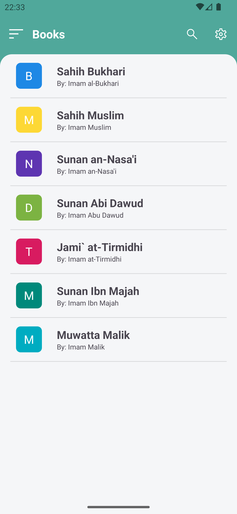
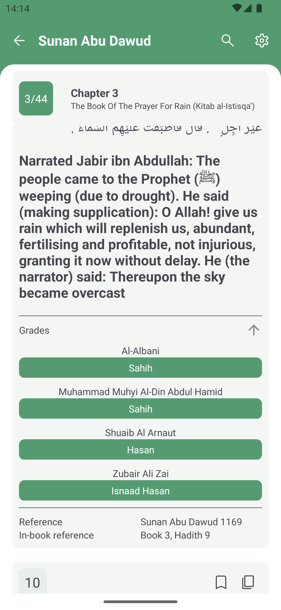

<!-- PROJECT LOGO -->
 

  <h3 align="center">Hadith Pro</h3>

  

    Simple Hadith Application with Different Languages and Hadith Gradings
     
   -
     
     
    <a href="https://github.com/unkn4wn/hadith-pro/issues">Report Bug</a>
    ·
    <a href="https://github.com/unkn4wn/hadith-pro/issues">Request App Feature</a>
    .
    <a href="https://github.com/fawazahmed0/hadith-api/issues">Report errors in Hadith Translation</a>
  

<!-- TABLE OF CONTENTS -->

  
Table of Contents

  <ol>
    <li>
      <a href="#about-the-project">About The Project</a>
    </li>
    <li>
      <a href="#current-features">Current Features</a>
    </li>
    <li><a href="#contributing">Contributing</a></li>
    <li><a href="#license">License</a></li>
    <li><a href="#acknowledgments">Acknowledgments</a></li>
  </ol>

<!-- ABOUT THE PROJECT -->
## About The Project
Hadith Pro provides you Ahadith in your language without showing you any annoying ads. We publish our code open sourcely and provide absolute transparency. We will never sell your data to third parties.

 
 
 

(<a href="#readme-top">back to top</a>)

<!-- CURRENT FEATURES -->
## Current Features:
* Browse through Ahadith in different languages
* Search a specific Hadith
* Hadith Grades

### Hadith Grades by
* Al-Albani, Zubair Ali Zai, Muhammad Fouad Abd al-Baqi, Shuaib Al Arnaut, Salim al-Hilali, Abu Ghuddah
### Ahadith available in
* Arabic, Bengali, English, French, Indonesian, Tamil, Turkish, Urdu
### Books
* Sahih Bukhari, Sahih Muslim, Sunan an-Nasa'i, Sunan Abi Dawud, Jami' at-Tirmidhi, Sunan Ibn Majah, Muwatta Malik

### Supported Platforms

- Android 5.0+

<!-- CONTRIBUTING -->
## Contributing

Contributions are what make the open source community such an amazing place to learn, inspire, and create. Any contributions you make are **greatly appreciated**.
If a particular book is not available in your language, you are welcome to actively expand our database of supported Hadith books and languages. 
You can find out how to add a translation here:

https://github.com/fawazahmed0/hadith-api/blob/1/CONTRIBUTING.md

**If you want to add a feature specific to this app instead:**

1. Fork the Project
2. Create your Feature Branch (`git checkout -b feature/AmazingFeature`)
3. Commit your Changes (`git commit -m 'Add some AmazingFeature'`)
4. Push to the Branch (`git push origin feature/AmazingFeature`)
5. Open a Pull Request

(<a href="#readme-top">back to top</a>)

<!-- LICENSE -->
## License

    Copyright 2022 Unkn4wn

    Licensed under the Apache License, Version 2.0 (the "License");
    you may not use this file except in compliance with the License.
    You may obtain a copy of the License at

        http://www.apache.org/licenses/LICENSE-2.0

    Unless required by applicable law or agreed to in writing, software
    distributed under the License is distributed on an "AS IS" BASIS,
    WITHOUT WARRANTIES OR CONDITIONS OF ANY KIND, either express or implied.
    See the License for the specific language governing permissions and
    limitations under the License.

(<a href="#readme-top">back to top</a>)

<!-- ACKNOWLEDGMENTS -->
## Acknowledgments

* [https://github.com/fawazahmed0/hadith] (for providing hadith translations)

(<a href="#readme-top">back to top</a>)

